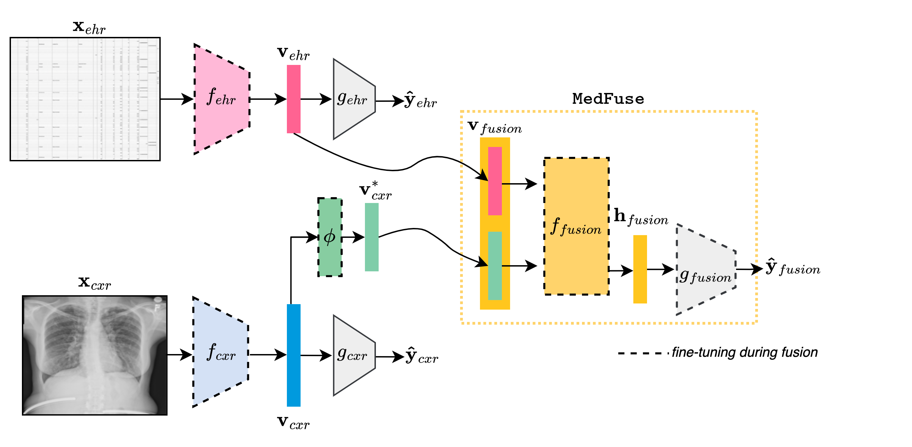

# Multimodal LSTM Paper Replication
**Replication Team:** Pranav Thatte
</br>

**Paper:** MedFuse: Multi-modal fusion with clinical time-series data
and chest X-ray images
</br>

**Original Repository:** https://github.com/nyuad-cai/MedFuse

#### Paper Citation
N. Hayat, K. J. Geras, and F. E. Shamout, 'MedFuse: Multi-modal fusion with clinical time-series data and chest X-ray images,' *Proceedings of Machine Learning Research*, vol. 182, pp. 1--25, 2022. Available: https://arxiv.org/abs/2207.07027

#### MIMIC-IV EHR Data
Johnson, A., Bulgarelli, L., Pollard, T., Horng, S., Celi, L. A., and Mark, R. (2021). MIMIC-IV (version 1.0). PhysioNet. https://doi.org/10.13026/s6n6-xd98.

#### MIMIC-CXR-JPG Data
Johnson, A., Lungren, M., Peng, Y., Lu, Z., Mark, R., Berkowitz, S., and Horng, S. (2019). MIMIC-CXR-JPG - chest radiographs with structured labels (version 2.0.0). PhysioNet. https://doi.org/10.13026/8360-t248.


## Contents
- [Introduction](./README.md#introduction)
- [Dependencies](./README.md#dependencies)
- [Data](./README.md#data)
- [Training and Evaluation](./README.md#training-and-evaluation)

## Introduction
This repository details the effort to reproduce the multimodal healthcare paper, MedFuse. MedFuse aims to predict phenotypes assigned to patients and in-hospital mortality within the first 48 hours of being admitted to an ICU. It does so through processing Electronic Health Records (EHR) timeseries data and thorax radiographs (CXR x-ray images) found in the `MIMIC-IV` and `MIMIC-CXR-JPG` datasets. The paper explores 3 main hypotheses:
> 1. Does multimodal data provide a strict advantage over unimodal data in healthcare applications for the tasks of phenotype and in-hospital mortality prediction?
> 2. Given that labels assigned to multimodal data can differ by modality and they are not collected synchronously in healthcare applications, is it a better idea to train encoders for each modality separately and fuse them in later stages of the architecture?
> 3. In healthcare treatment processes, medical staff often collect data sequentially, as needed, as the patient condition evolves. Does it make sense to model modalities as events in a sequence rather than occurring jointly in time?

The paper’s core contribution involves treating multi-modal data as a series of sequential inputs to an LSTM-based module, in contrast with previous work that created a single combined representation of all available modalities. Additionally, they establish a benchmark for multimodal performance on the tasks of phenotype and in-hospital mortality prediction.



## Dependencies

In this section, information required for installing the necessary dependencies is provided.

1. To load all dependencies for the project, first create an environment using `conda create --name [ENV NAME]` and `conda actimate [ENV NAME]`
2. `pip freeze` has generated `requirements.txt` that can be found in the repository
3. Here is a short list of required packages below:
   - matplotlib 3.10.1
   - numpy 2.2.4
   - pandas 2.2.3
   - pillow 11.2.1
   - python 3.13.2
   - pyyaml 6.0.2
   - scikit-learn 1.6.1
   - scipy 1.15.2
   - torch 2.7.0
   - torchvision 0.22.0
   - tqdm 4.67.1

## Data

To acquire the data, please follow the links for each dataset found at the top of the README. From there, you will need to complete a health research course (1 hr) and sign a few forms before getting access to the datasets. I would suggest to create an umbrella folder where the core code lies in one folder and the data is downloaded in another.
</br>

#### MIMIC-IV
This dataset is roughly 7GB. I would suggest to download it in a folder different from any Github repository for data privacy and size considerations. In order to download the full dataset, you can either directly download it from the website or use the following command:
```
wget -r -N -c -np --user [USERNAME] --ask-password https://physionet.org/files/mimiciv/1.0/
```

Afterwords, the steps from the original paper can be followed for preprocessing as they are documented well: https://github.com/nyuad-cai/MedFuse/blob/main/mimic4extract/README.md

</br>
Here is a brief overview of the steps required:

1. Extract data from `.csv` files for each subject and store them into `data/{SUBJECT_ID}`
```
python -m medfuse.datasets.process_mimic.extract_subjects_iv [path to gunzipped csv files] data/root 
```

2. Now, the data will exist in data/root, we can clean the data (missing information etc.) and break data into episode-level info (each ICU stay)
```
python -m medfuse.datasets.process_mimic.validate_events data/root
```
```
python -m medfuse.datasets.process_mimic.extract_episodes_from_subject data/root
```

3. Lastly, we do train/val/test splits on the data, then further split for each task with labels for each.
```
python -m medfuse.datasets.process_mimic.split_train_and_test data/root/
```
```
python -m medfuse.datasets.process_mimic.create_in_hospital_mortality data/root/ data/in-hospital-mortality/
```
```
python -m medfuse.datasets.process_mimic.create_phenotyping data/root/ data/phenotyping/
```

#### MIMIC-CXR-JPG
This dataset is very large (~550 GB), as such, for the purposes of replication, only 10% of the data was used, the subject ID's starting with `p10XXXXXX`. To download such a dataset, please use the Google Cloud Bucket that is provided through the dataset website as directly downloading the data is too slow. In order to transfer the files, you will need to activate a Google Cloud billing project (see note below). These files will be copied to a Google Drive folder where they can be accessed via colab or downloaded in some faster manner afterwords. To do so on Colab, a template for the code cells is provided at `medfuse/google_colab_scripts/transfer_bucket.py`, please replace the variables as needed with the correct paths and billing account.

> NOTE
> The preprocessing scripts included in this repo for images already has filtering logic in the EHR data to subset the data to match the CXR subset.
> The files are well organized on the Physionet.org site, as such, please look for the subset of folders that you would like, e.g. `p10`.
> Google Cloud credits are available for students or for those with a free trial; the data transfer should cost less than $5.00.

To preprocess the CXR images through Colab please see the code provided here: `medfuse/google_colab_scripts/preprocess_cxr.py`

## Training and Evaluation

#### Core Trainer
The core trainer is located at `medfuse/trainers/fusion_trainer.py` and is activated by calling the driver script located at `medfuse/scripts/fusion_main.py`. This script further depends on support objects for preprocessing (e.g. Discretizer, Normalizer, Dataset objects) and model definitions `medfuse/models`.

#### Running `fusion_main.py`
In order to run `fusion_main.py`, the bash scripts used during replication are available in the `medfuse/scripts` folder. To run them, please change the paths to the appropriate locations for where your data lies in `medfuse/scripts/arguments.py` and the save directory for the resulting checkpoints in the scripts themselves. To run the bash scripts on Colab, you can use the following code as a template:
```
# ---- mount your drive ----
from google.colab import drive
try:
    print("Attempting to unmount Drive...")
    drive.flush_and_unmount()
    print("Drive unmounted.")
except Exception as e:
    print(f"Error during unmount (might not have been mounted): {e}")

print("Remounting Drive...")
drive.mount('/content/drive', force_remount=True)
print("Drive remounted.")

# ---- clone your repository ----
!git clone https://github.com/USERNAME/REPO_NAME.git
import os
%cd REPO_NAME/
print(f"Current directory: {os.getcwd()}")
# !git pull

# ---- run your script ----
# Pull latest changes
!git pull

import sys
project_root = '/content/REPO_NAME'
if project_root not in sys.path:
    sys.path.append(project_root)

# Add the 'trainers' subdirectory to the path
sys.path.append(os.path.join(project_root, 'trainers'))

# Change working directory
%cd /content/REPO_NAME/

# Run the script
!sh ./scripts/train_medfuse_module.sh
```